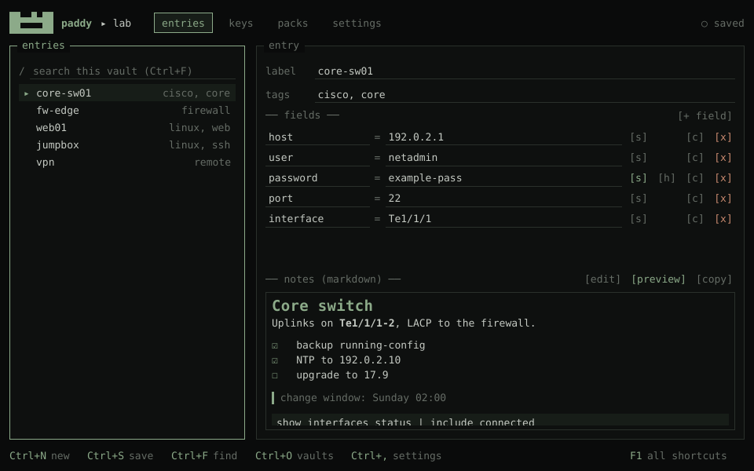
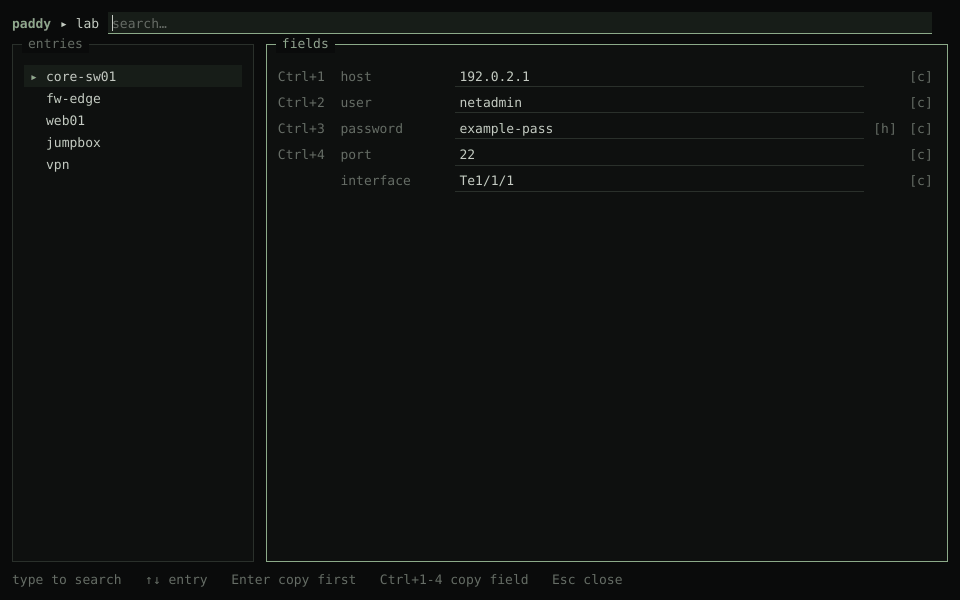
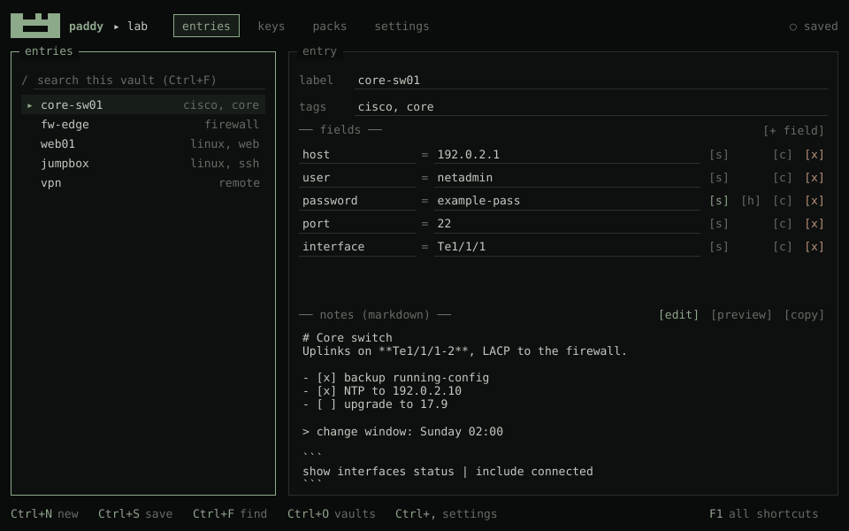
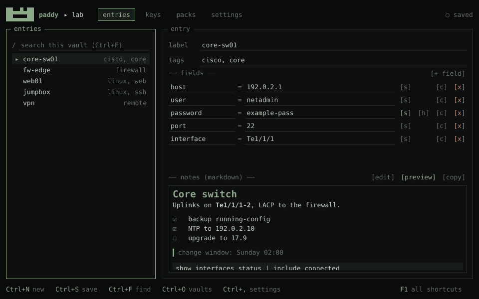
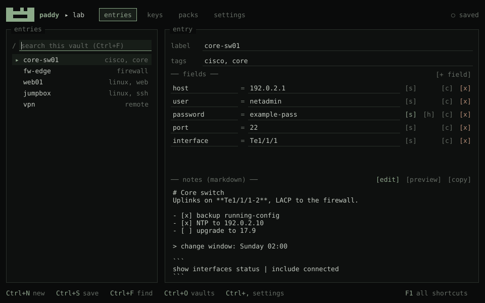
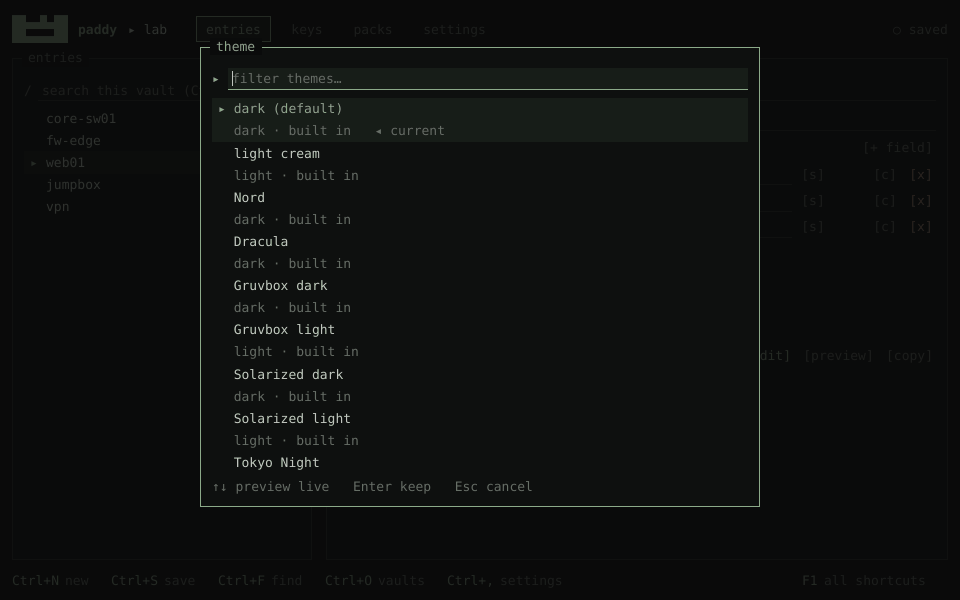
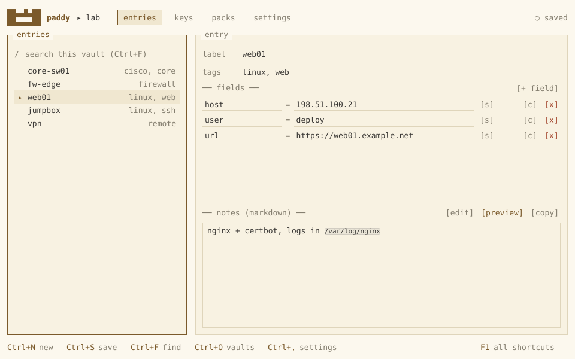
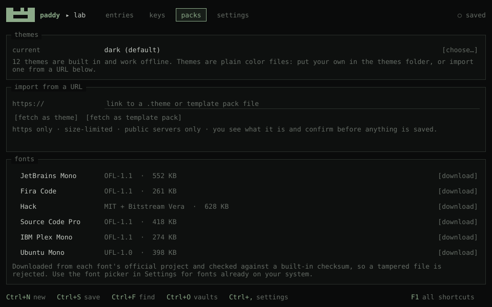
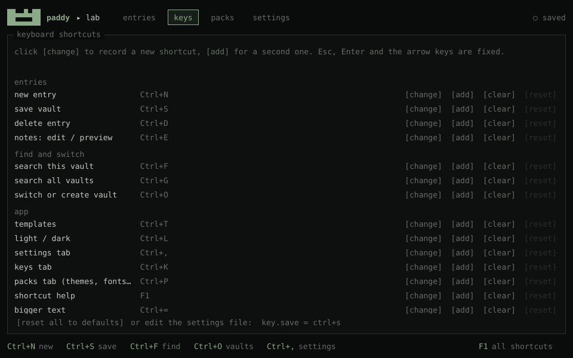

<p align="center"></p>

<h1 align="center">paddy</h1>

<p align="center">
A keyboard-first desktop pad for the IPs, hosts, credentials and commands you reuse all day.<br>
Network engineering, labs, exams. Rust + Slint, local SQLite vaults, offline by default.
</p>

<p align="center">
<a href="https://github.com/l1ght-man/paddy/releases/latest"></a>
<a href="https://github.com/l1ght-man/paddy/actions/workflows/ci.yml"></a>

<a href="LICENSE"></a>
</p>

<p align="center"></p>

## Install

```sh
curl -fsSL https://raw.githubusercontent.com/l1ght-man/paddy/main/install.sh | sh
```

Linux x86_64 (Kali, Debian 11+, Ubuntu 20.04+, Fedora 32+). No root needed: it installs to `~/.local/bin`,
adds that to your `PATH` (bash and zsh), and puts paddy in your applications menu. The download is checked
against its SHA-256 before anything is installed, and if a library is missing it tells you (and offers to `apt install` it).

```sh
paddy            # start it (or pick it from the menu)
paddy-doctor     # check tray, hotkey and libraries on this desktop
curl -fsSL https://raw.githubusercontent.com/l1ght-man/paddy/main/install.sh | sh -s -- --uninstall
```

Options: `--system` (install to `/usr/local`), `--from-source` (build with cargo), `--no-deps`.
Uninstalling keeps your vaults and settings.

**Manual download:** grab `paddy-x86_64-linux.tar.gz` and `SHA256SUMS` from the
[latest release](https://github.com/l1ght-man/paddy/releases/latest), then:

```sh
sha256sum -c SHA256SUMS --ignore-missing
tar xzf paddy-x86_64-linux.tar.gz && ./paddy-x86_64-linux/paddy
```

## Tour

| | |
|---|---|
| **Quick list** from the tray or `Ctrl+Alt+P`, anywhere: type to filter, `Ctrl+1..4` copies a field | **Templates** fill themselves from the selected entry (`Ctrl+T`) |
|  |  |
| **Notes are markdown**, `Ctrl+E` flips edit / preview | **Search** the vault as you type (`Ctrl+F`), or all vaults (`Ctrl+G`) |
|  |  |
| **12 themes**, previewed live | **Light cream** |
|  |  |
| **Packs**: themes, fonts, template packs | **Every shortcut is yours to rebind** (`Ctrl+K`) |
|  |  |

## Features

- **Vaults**: one SQLite file per project, switch with `Ctrl+O`, search one (`Ctrl+F`) or all (`Ctrl+G`).
- **Entries**: label, tags, key/value fields (secrets can be masked), markdown notes with a preview (`Ctrl+E`).
- **Templates**: `ssh {user}@{host}` style commands, auto-filled from the selected entry (`Ctrl+T`). Four built-in packs (network engineering, recon, file transfer/tunnels, Windows/AD).
- **Quick list**: tray icon or global hotkey (`Ctrl+Alt+P`, X11) opens a small searchable popup; `Ctrl+1..4` copies a field.
- **Runs in the background**: closing the window hides paddy to the tray (quit from the tray menu); optional start on login, hidden in the tray by default; launching it again just brings the running one back. All three are on the settings tab.
- **Looks**: 12 themes, downloadable fonts (checksum-verified), text size, spacing, a floppy logo.
- **Keys**: every shortcut can be rebound on the keys tab (`Ctrl+K`); `F1` lists them.

## Build from source

```sh
cargo run --release                 # dev machine
scripts/release.sh                  # portable binary (glibc 2.30+): target/x86_64-unknown-linux-gnu/release/paddy
scripts/wsl-run.sh                  # inside WSL (fetches two X11 keyboard libraries, no sudo)
```

Build dependencies (Debian/Kali/Ubuntu): `sudo apt install -y pkg-config libfontconfig1-dev libxkbcommon-dev`.

## Is my machine OK?

```sh
scripts/doctor.sh ./paddy
```

Read-only check: libraries (with the exact `apt install` line if something is missing), session type,
window manager, tray support, global hotkey, clipboard manager, and a 5-second launch test.

Tested in containers on Kali rolling + XFCE, Debian 11 + Openbox and Fedora + i3 (`scripts/distro-test.sh`, needs Docker).

| | X11 (XFCE, Openbox, i3, ...) | Wayland |
|---|---|---|
| main window, quick list | yes | yes (not yet tested on a real session) |
| tray icon | yes, with a StatusNotifier tray (XFCE "Status Tray Plugin", KDE); otherwise a floating button | same |
| global hotkey | yes | no (Wayland doesn't allow it): use the tray icon or floating button |

## Where things live

| | |
|---|---|
| settings | `~/.config/paddy/config` (plain text, hand-editable, e.g. `key.save = ctrl+s`) |
| vaults, themes, fonts | `~/.local/share/paddy/` |
| start on login | `~/.config/autostart/paddy.desktop` (only while that setting is on) |
| running instance | a socket in `$XDG_RUNTIME_DIR` (`paddy-<hash>.sock`) |
| everything, for testing | set `PADDY_HOME=/some/dir` |

## Security

- Vaults are **not encrypted** yet: they are owner-only files (0600) in owner-only folders (0700). Use disk encryption.
- Only `paddy-net` touches the network, and only when you click download/import: https only, public
  servers only (no localhost/LAN/cloud-metadata, also after redirects), proxy variables ignored,
  size and time limits, nothing identifying sent.
- Fonts are pinned by SHA-256 to exact upstream releases; themes and template packs are parsed strictly,
  shown to you, and saved only after you confirm. Nothing downloaded is ever executed.
- Copied secrets are cleared from the clipboard after 30 s (configurable).

`scripts/security.sh [--live]` runs the checks: no-`unsafe` scan, clippy, tests including parser fuzzing,
RustSec dependency audit, and (with `--live`) real downloads against the pinned checksums.

## Development

```sh
scripts/check.sh                    # clippy + all tests
PADDY_SHOTS=/tmp/shots cargo test -p paddy-ui   # renders PNG screenshots of the real UI
scripts/perf.sh 2000 30             # RAM / CPU with 2000 fake entries
cargo run -p paddy-core --example seed -- vault.db 500
cargo run --release -p paddy-ui --example record_media   # regenerate docs/media (screenshots + GIFs)
cargo run -p paddy-ui --example make_icons              # regenerate assets/icons from the logo
```

Releases: push a tag like `v0.1.0`; the release workflow builds the portable binary and
publishes it with a `SHA256SUMS` file that `install.sh` verifies.

Crates: `paddy-core` (data, storage, parsing, no UI, no network), `paddy-net` (downloads), `paddy-ui` (Slint app).

## License

MIT. Downloaded fonts keep their own licenses (OFL, UFL, MIT), shown in the packs tab.
